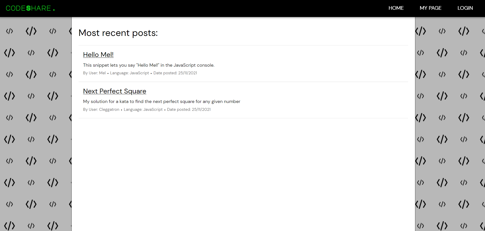
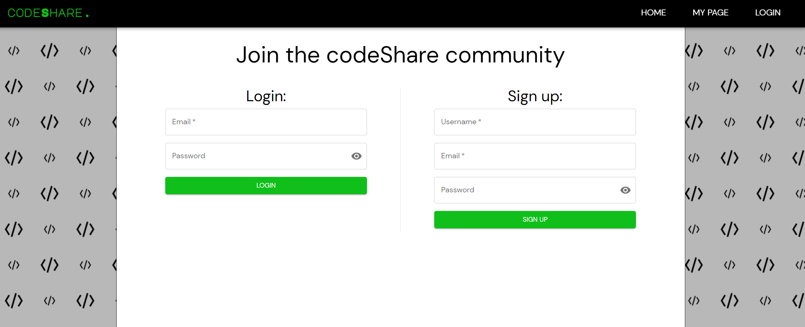
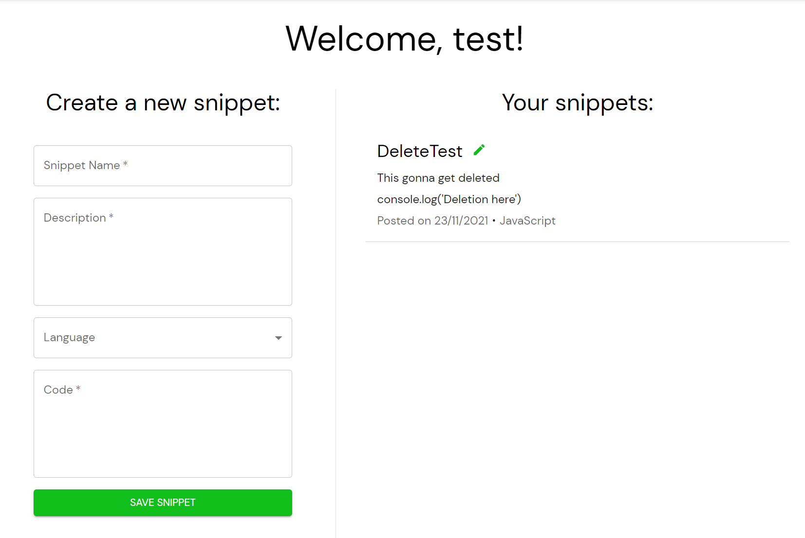
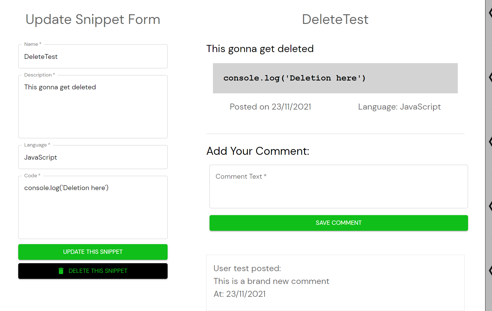

# codeShare

[Deployed Site](https://mdmcodeshare.herokuapp.com/)

### Table of Contents

- [User Story](#user-story)
- [Installation](#installation)
- [Usage](#usage)
- [Application Image](#application-image)
- [Credits](#credits)
- [Questions](#questions)

## User Story

As a group of developers, we thought very carefully about what tools we could utilize to make the arduous task of coding more straightforward and streamlined. We decided that an application which allows developers to share snippets of their code would be a perfect place for experienced and competent developers to share their know-how and contribute to creating a platform which is a one-stop shop of code snippets in different languages which can be used by users to create their dream projects. This is what codeshare attempts to achieve, the core principles which have shaped this journey are simple, Clarity, Access and Security. Find the code snippet you need quickly and easily with codeShare and whilst you’re here why not contribute your own code snippet to help current and future developers and grow the community in the process !

As a writer of code. I want to be able to post code snippets i'm proud of online:

Given the website:

When I load the website
Then I am presented with the homepage, with new code snippets.
When I want to add a code snippet
Then I am prompted to login
When I log in 
Then I am taken to a personal page
When I arrive on the personal page
Then I can view my current code snippets and add a new one.
When I add a new snippet
Then it is stored on the database, and displays on the homepage.
When I add a comment
Then it is stored in the database, and displays on the homepage.

## Installation

1. Clone the above repo to your machine

2. Ensure that mongoDB is installed on your machine

3. Run `npm run install` to install your dependencies

4. Run `npm run develop` to start both client side and server side in development mode

5. The application will render on your localhost 

## Usage

1. Once the site is loaded you will be able to view the homepage and current existing snippets

2. Navigate to the login page to login or sign up

3. Navigate to My Page to add a new code snippet and view existing snippets.

4. Clicking into snippets on your home page will bring up the function to add a comment, edit, or delete the snippet.

5. Clicking into other users snippets on the homepage will allow you to leave a comment on their code

## Application Image 

## Credits

## Questions

If you have any questions feel free to contact us here:

 ##### Github: 

 [David Clegg](https://github.com/Cleggatron)
 [Mel Jack](https://github.com/meljack1/)

 ##### Email: 

david.robert.clegg@gmail.com
mel.jack.developer@gmail.com

